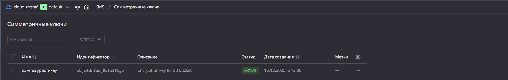
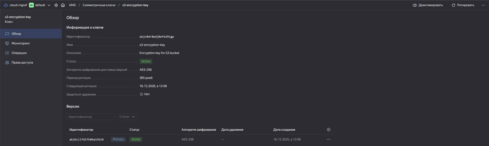
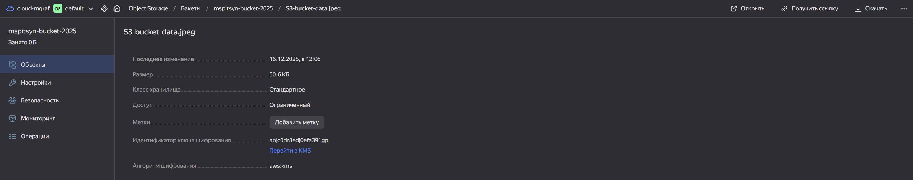
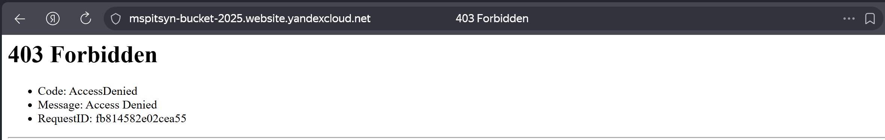
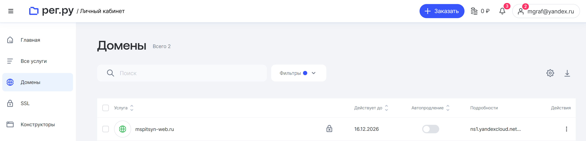
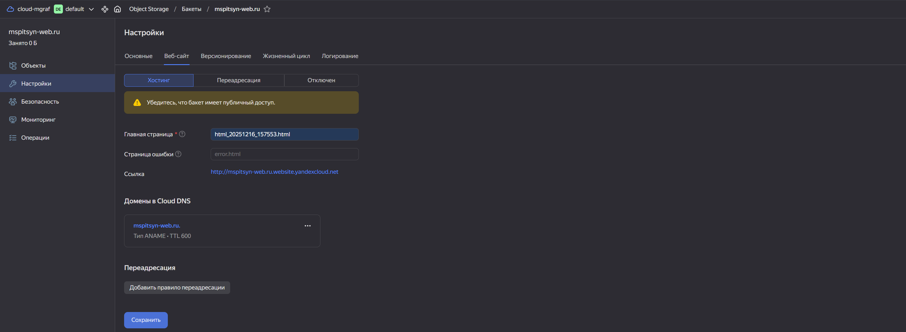
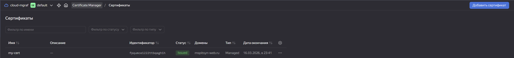
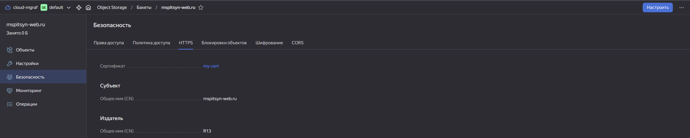
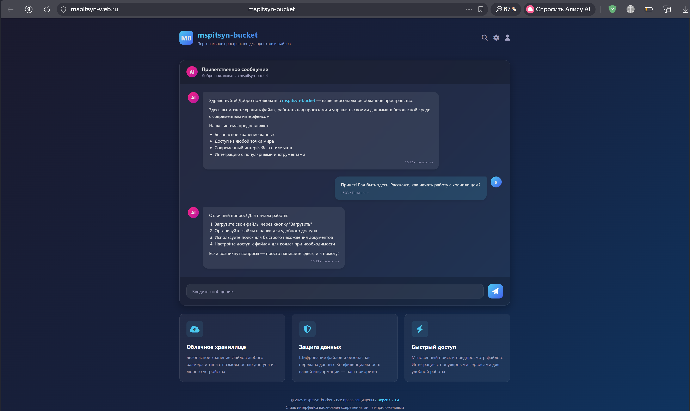

# Домашнее задание к занятию «Безопасность в облачных провайдерах»  

Используя конфигурации, выполненные в рамках предыдущих домашних заданий, нужно добавить возможность шифрования бакета.

---
## Задание 1. Yandex Cloud   

1. С помощью ключа в KMS необходимо зашифровать содержимое бакета:

 - создать ключ в KMS;
 - с помощью ключа зашифровать содержимое бакета, созданного ранее.
2. (Выполняется не в Terraform)* Создать статический сайт в Object Storage c собственным публичным адресом и сделать доступным по HTTPS:

 - создать сертификат;
 - создать статическую страницу в Object Storage и применить сертификат HTTPS;
 - в качестве результата предоставить скриншот на страницу с сертификатом в заголовке (замочек).

Полезные документы:

- [Настройка HTTPS статичного сайта](https://cloud.yandex.ru/docs/storage/operations/hosting/certificate).
- [Object Storage bucket](https://registry.terraform.io/providers/yandex-cloud/yandex/latest/docs/resources/storage_bucket).
- [KMS key](https://registry.terraform.io/providers/yandex-cloud/yandex/latest/docs/resources/kms_symmetric_key).

--- 
## Решение задания 1.  
1. В [bucket.tf](./terraform/bucket.tf) создаем kms ключ и шифруем им s3-bucket.
- Проверяем, что ключ создался:  
    
    
- Файл зашифрован:  
    
- При попытке открыть файл по ссылке, получаем ошибку:  
    
  
2. Создаем статический сайт в Object Storage c собственным публичным адресом и делаем его доступным по HTTPS:  
- Для выполнения этого задания регистрирую свой домен в РЕГ.РУ и настраиваю список DNS-серверов, ссылающие на NS yandexcloud.net:  
    
- Создаю новый бакет и загружаю в него индексную страницу:  
    
- Добавляем сгенерированный сертификат:  
    
- Включаем HTTPS для сайта, привязав к нему созданный сертификат:  
  
- Заходим на страницу (https://mspitsyn-web.ru) и видим, что сама страница отображается и что подключение защищено:  
    

---  

### Правила приёма работы

Домашняя работа оформляется в своём Git репозитории в файле README.md. Выполненное домашнее задание пришлите ссылкой на .md-файл в вашем репозитории.
Файл README.md должен содержать скриншоты вывода необходимых команд, а также скриншоты результатов.
Репозиторий должен содержать тексты манифестов или ссылки на них в файле README.md.
